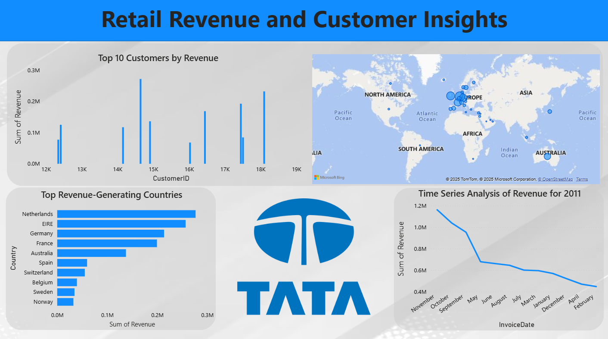

# 📊 TATA Power BI Job Simulation

This project is part of the **Tata Data Visualisation Job Simulation** on the [Forage](https://www.theforage.com/) platform (January 2025). It demonstrates data visualization expertise through the creation of a Power BI dashboard based on retail data, highlighting business KPIs and insights in response to simulated client requests.

---

## 🧠 Project Overview

The goal of this simulation is to showcase the ability to:
- Analyze business data and identify key trends.
- Design and build insightful dashboards using Power BI.
- Present meaningful visualizations to inform decision-making.
- Align business insights with stakeholder objectives.

The dataset used represents an online retail company's transactional data and customer behavior.

---

## 📁 Files Included

| File Name                    | Description                                                                 |
|-----------------------------|-----------------------------------------------------------------------------|
| `Online Retail Data Set.xlsx` | Raw dataset used for the Power BI dashboard.                                |
| `task 3.pbix`               | The Power BI project file containing the final dashboard.                   |
| `Dashboard.png`             | Static screenshot of the dashboard.                                         |
| `dashboard record.gif`      | GIF recording demonstrating dashboard interactivity.                        |
| `README.md`                 | This file.                                                                  |

---

## 💡 Key Insights

- 📈 **Sales Performance**: Trends in sales across customer segments and product types.
- 🧾 **Order Details**: Order volume, average order value, and product sales breakdown.
- 🎯 **Customer Segmentation**: Distribution based on location, purchase frequency, and value.
- ⏳ **Time-Based Patterns**: Sales behavior across different months and quarters.

---

## 🖥️ Power BI Dashboard Preview

### 📸 Dashboard Screenshot

**Retail Dashboard Overview**  

### 🎥 Dashboard Interactivity Preview (GIF)

**Interactive Dashboard Walkthrough**  

---

## 🛠️ Tools & Technologies Used

- **Power BI** – For data modeling, dashboard creation, and visualization.
- **Microsoft Excel** – For raw data analysis and preprocessing.
- **GitHub** – Version control and project documentation.

---

## 👨‍💻 Author

**Avik Sarkhel**  
🎓 MCA Student | Aspiring Data Analyst  
📍 Kolkata, India  
📫 Email: [avik305sarkhel@gmail.com](mailto:avik305sarkhel@gmail.com)  
🔗 LinkedIn: [linkedin.com/in/avik-sarkhel](https://www.linkedin.com/in/avik-sarkhel)

---

## 🚀 Explore More

This project reflects my ability to convert raw business data into clear, interactive visuals that empower data-driven decision-making. Feel free to explore the `.pbix` file or reach out with any questions or feedback!

---
